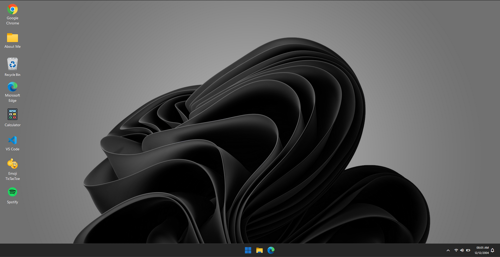
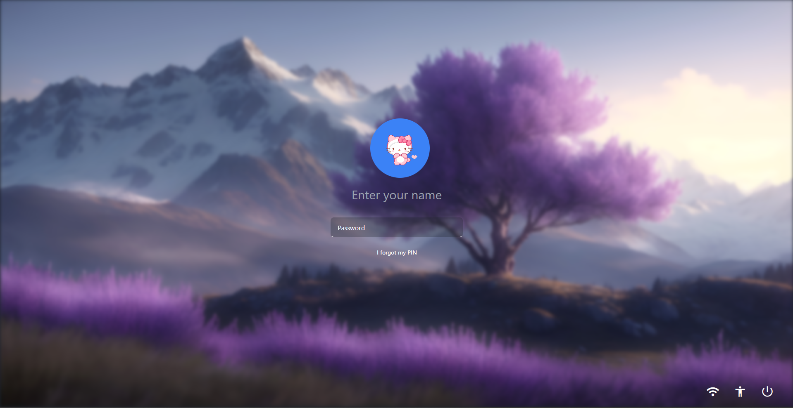
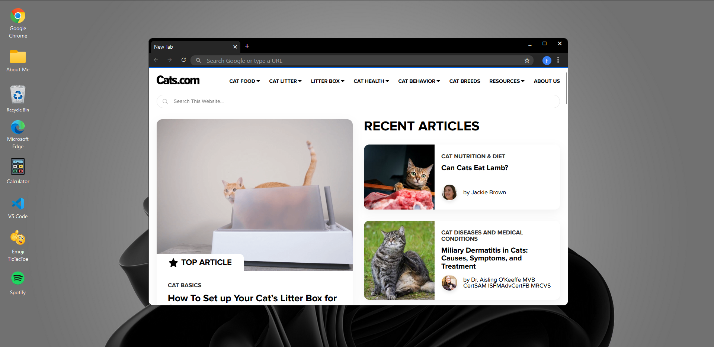
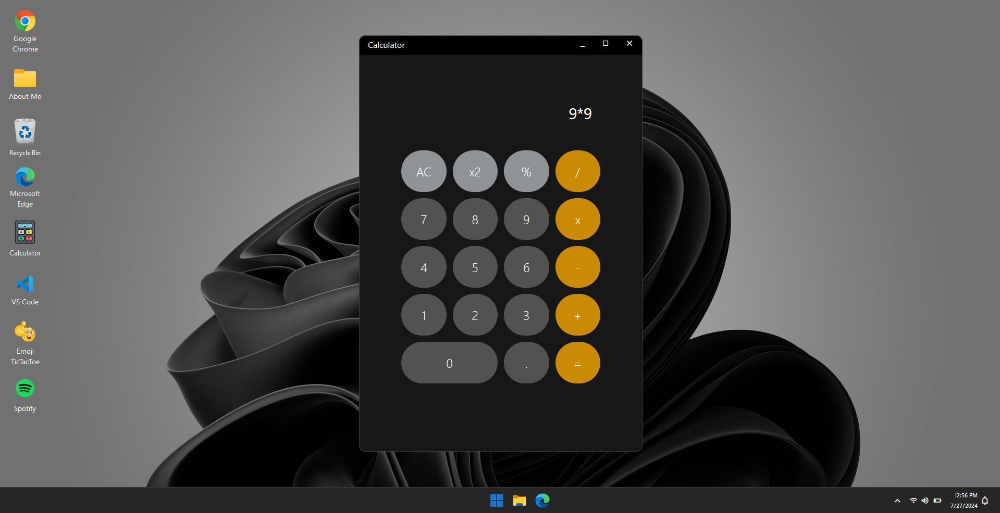
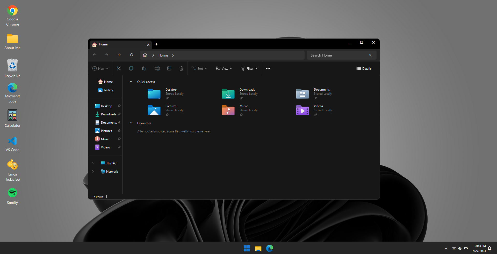
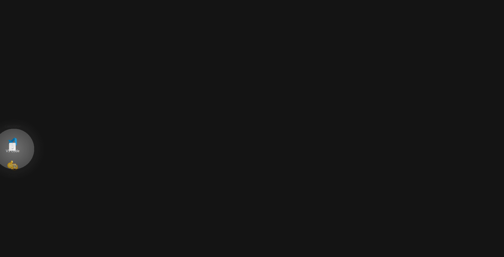
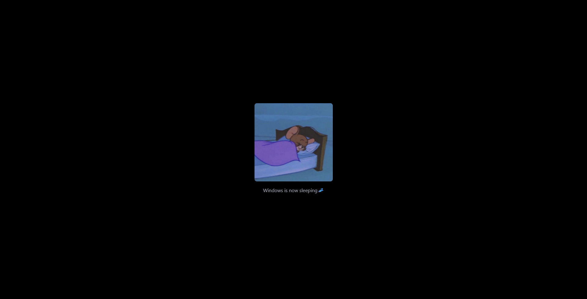
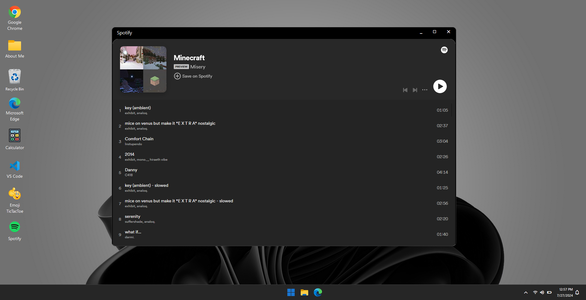
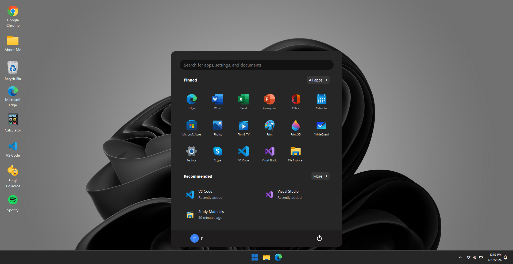

# <div style="margin:10px 0px; font-size:50px;" align="center">🖥️ Windows 11</div>

This is **Vidhitam Chakole**'s Windows-style portfolio, built with **React.js**. Dive into an interactive desktop simulation with apps and features to explore.

<p align="center">
    
    
    <p align="center"><strong>You can enter anything on the login page to gain access to the app. No need for actual credentials!</strong></p>
</p>

## <div style="margin-left:10px;">🎨 Features

- **🌐 Browser windows**: Chrome and Edge are simulated with fake browsing experiences.
- **🧮 Calculator**: Perform arithmetic with a working calculator and built-in easter egg.
- **💻 VS Code**: Virtual editor shell for a portfolio-style workspace mockup.
- **🎵 Spotify**: Embedded playlist experience inside the desktop UI.
- **📁 Explorer**: Portfolio and about-me navigation with fake desktop folders.
- **🧪 Desktop Destroyer**: Full-screen canvas toy with destructive tools and effects.
- **📱 Mobile optimization**: Responsive layout, landscape prompts, and portable window behavior.
- **🎨 Video wallpaper toggle**: Swap the static wallpaper for a looping video background.
- **🔒 Lock-screen and sleep states**: Windows-like login, sleep, and shutdown flows.

## <div style="margin-left:10px;">🚀 Installation

To get this project running on your local machine, follow these simple steps:

1. **Clone the repository:**

   ```bash
   git clone <your-repository-url>
   ```

2. **Navigate to the project directory:**

   ```bash
   cd Portfolio
   ```

3. **Install the dependencies:**

   ```bash
   npm install
   ```

4. **Start the development server:**

   ```bash
   npm start
   ```

   Your app will open in your default web browser at [http://localhost:3000](http://localhost:3000) 🎉

## <div style="margin-left:10px;">💻 Usage

- **Login Page**: You can enter anything on the login page to gain access to the app. No need for actual credentials! 🔐
- Click on the icons on the desktop to open the different apps.
- Use the taskbar to switch between open applications.
- On smaller screens, the app now adapts with viewport-aware sizing, portrait prompts, and mobile-friendly dragging.
- Interact with the apps to explore their features and functionalities!

## <div style="margin-left:10px;">🛠️ Technologies Used

- **React.js**: For building the interactive user interface.
- **Tailwind CSS**: For styling the components and creating a desktop-like experience.
- **React Router DOM**: For managing navigation and routing within the app.
- **Framer Motion**: For adding animations and transitions.
- **React Draggable**: For making elements draggable.

## <div style="margin-left:10px;">🤝 Contributing

Want to contribute? We’d love your help! Fork the repository, make your changes, and submit a pull request. Please follow the coding standards and include tests where necessary.

## <div style="margin-left:10px;">🚧 Note

I’m a beginner in React.js and web development, so my code might not be perfect. I’m constantly learning and improving, so any constructive feedback is appreciated!

## <div style="margin-left:10px;">📸 Screenshots

<p align="center">
    
    
    
    
    
    
    
    
</p>

<div style="margin:20px; font-size:20px;"><strong>Enjoy exploring this Windows Clone app! 🎉💻🖱</strong>
