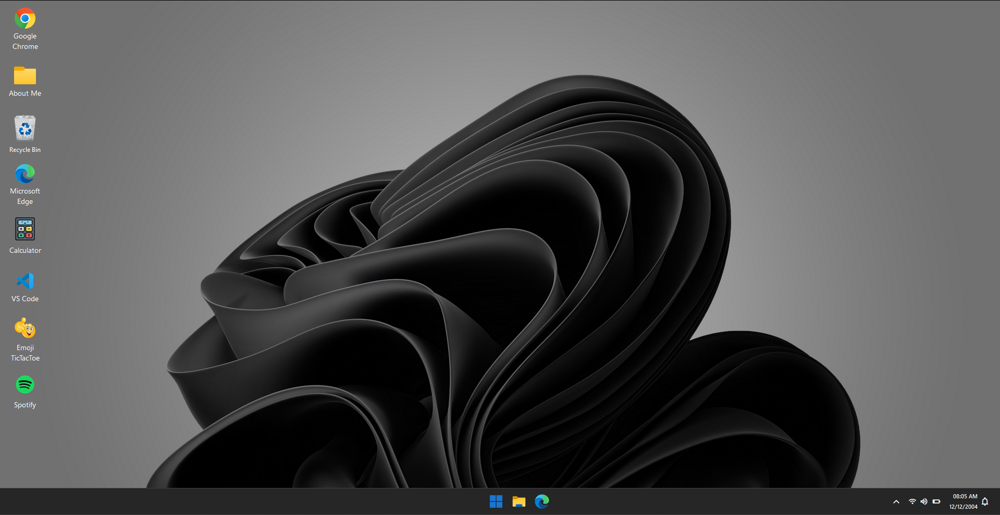
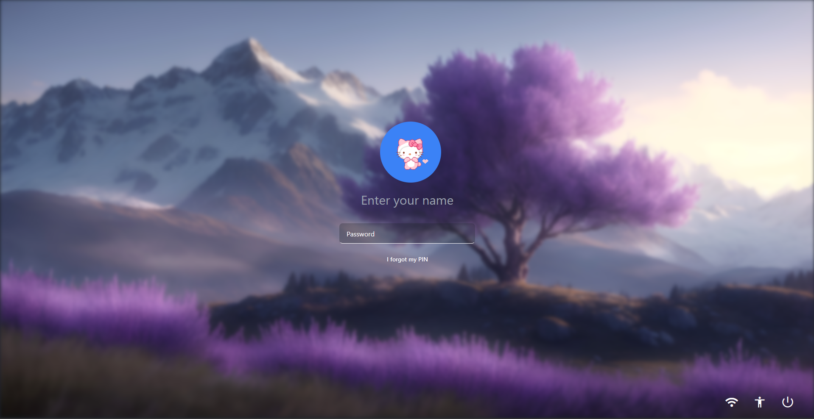
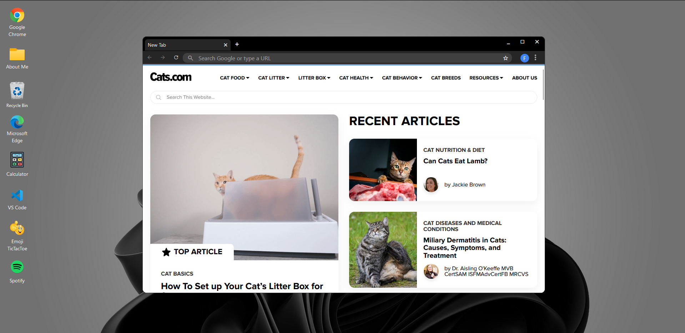
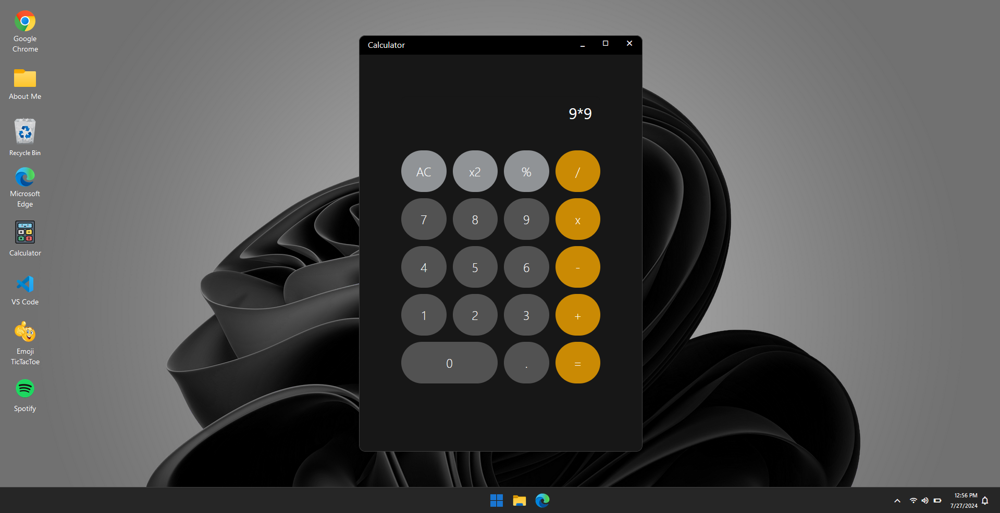
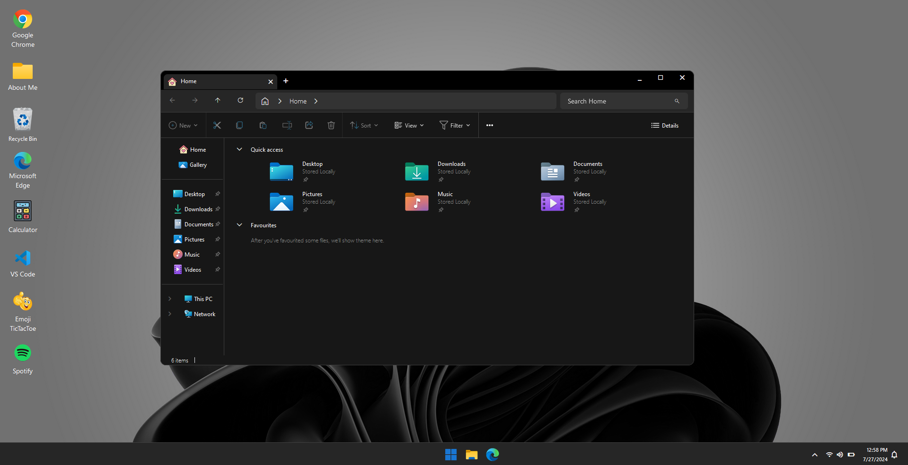
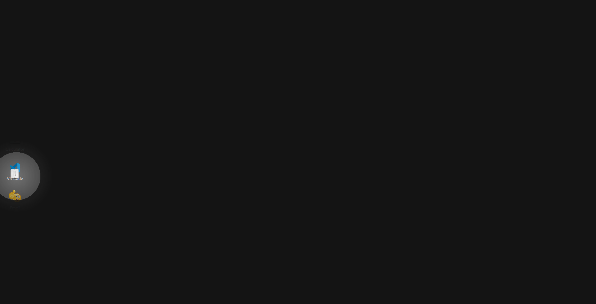
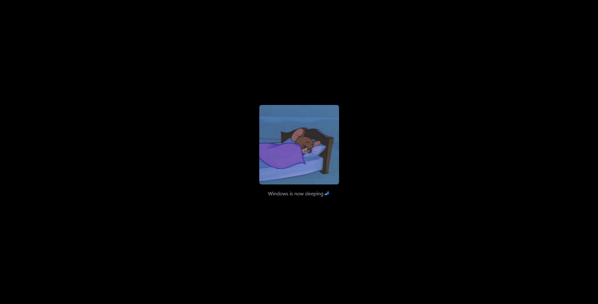
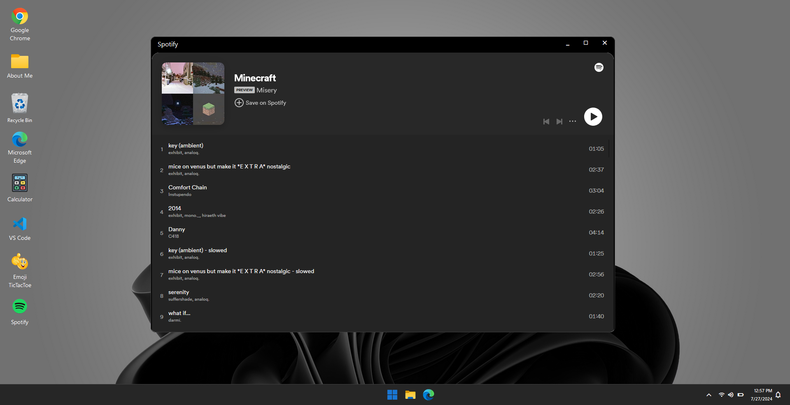
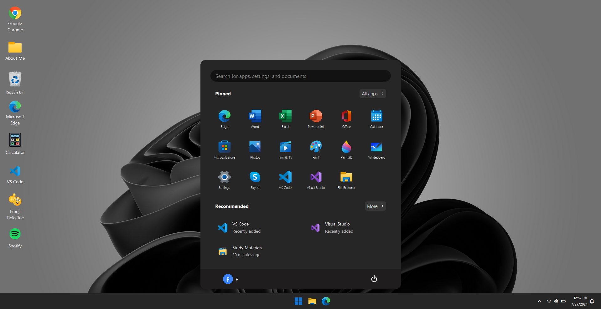

# <div style="margin:10px 0px; font-size:50px;" align="center">🖥️ Vidhitam's Windows Portfolio</div>

This is **Vidhitam Chakole**'s Windows-style portfolio, built with **React.js**. Explore an interactive desktop simulation that presents projects, experiments, and profile details through familiar desktop apps.

The experience is designed to be explored like a personal computer: sign in, open apps from the desktop or Start menu, move windows around, and use the taskbar to switch between them.

## Contents

- [Features](#-features)
- [Installation](#-installation)
- [Usage](#-usage)
- [Technologies](#-technologies-used)
- [Contributing](#-contributing)

<p align="center">
    
    
    <p align="center"><strong>You can enter anything on the login page to gain access to the app. No need for actual credentials!</strong></p>
</p>

## <div style="margin-left:10px;">🎨 Features

- **🌐 Chrome**: Surf the web just like in a real Chrome browser.
- **🧮 Calculator**: Perform basic arithmetic operations with this handy calculator.
- **💻 VS Code**: Virtual Visual Studio Code environment.
- **🎵 Spotify**: Enjoy a simulated music player interface.
- **📁 About Me**: Learn about Vidhitam Chakole.
- **🗂️ File Explorer**: Browse the portfolio's project and media folders.
- **🧹 Recycle Bin**: Explore a playful simulated recycle bin.
- **🛠️ Desktop Destroyer**: Interact with a canvas-based desktop destruction experiment.

## <div style="margin-left:10px;">🚀 Installation

To get this project running on your local machine, follow these simple steps:

### Prerequisites

- Node.js 18 or newer
- npm 9 or newer
- A modern desktop browser with JavaScript enabled

1. **Clone the repository:**

   ```bash
   git clone https://github.com/Vidhitam-chakole/Portfolio.git
   ```

2. **Navigate to the project directory:**

   ```bash
   cd Portfolio
   ```

3. **Install the dependencies:**

   ```bash
   npm install
   ```

4. **Start the development server:**

   ```bash
   npm start
   ```

   Your app will open in your default web browser at [http://localhost:3000](http://localhost:3000) 🎉

For a production-style check, create an optimized bundle with `npm run build`. The generated files are written to the `build/` directory.

## <div style="margin-left:10px;">💻 Usage

- **Login Page**: You can enter anything on the login page to gain access to the app. No need for actual credentials! 🔐
- After login, the portfolio opens at a user-specific desktop route such as `/Vidhitam`.
- Click on the icons on the desktop to open the different apps.
- Use the taskbar to switch between open applications.
- Drag a window by its title bar to reposition it, and use the title-bar controls to minimize or close it.
- Interact with the apps to explore their features and functionalities!

## <div style="margin-left:10px;">🛠️ Technologies Used

- **React.js**: For building the interactive user interface.
- **Tailwind CSS**: For styling the components and creating a desktop-like experience.
- **React Router DOM**: For managing navigation and routing within the app.
- **Framer Motion**: For adding animations and transitions.
- **React Draggable**: For making elements draggable.

## <div style="margin-left:10px;">🤝 Contributing

Want to contribute? We’d love your help! Fork the repository, make your changes, and submit a pull request. Please follow the coding standards and include tests where necessary.

## <div style="margin-left:10px;">🚧 Note

I’m a beginner in React.js and web development, so my code might not be perfect. I’m constantly learning and improving, so any constructive feedback is appreciated!

## <div style="margin-left:10px;">📸 Screenshots

<p align="center">
    
    
    
    
    
    
    
    
</p>

<div style="margin:20px; font-size:20px;"><strong>Enjoy exploring this Windows Clone app! 🎉💻🖱</strong>
