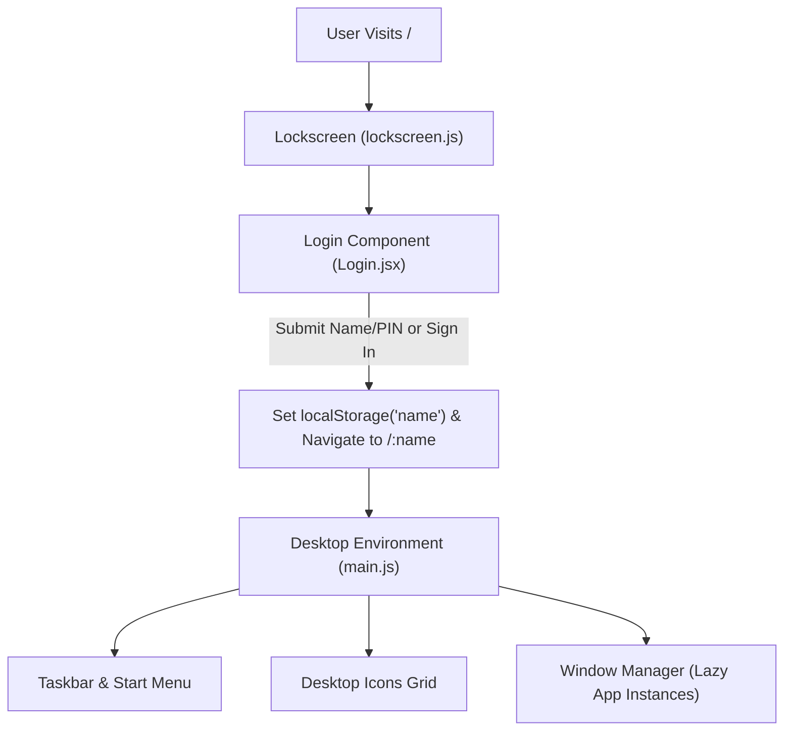

# Windows 11 Web Portfolio — AI Developer Blueprint & Master Knowledge Base

> **Primary AI Directive**: This `brain.md` document is the single source of truth for the entire Windows 11 Web Desktop Portfolio project. Any AI assistant or developer working on this codebase must consult and adhere to the architectural patterns, state models, data schemas, and performance constraints defined herein.

---

## 1. Project Overview & Tech Stack

### 1.1 Purpose
A high-fidelity **Windows 11 Web Desktop Experience** and interactive portfolio simulator. It emulates the Windows 11 Fluent Design System, acrylic glassmorphism, window management (drag, minimize, maximize, bring-to-front), Start Menu, Taskbar, Lock Screen, and interactive desktop applications.

### 1.2 Tech Stack
| Category | Technology | Version | Purpose / Notes |
| :--- | :--- | :--- | :--- |
| **Core Framework** | React | `^18.2.0` | UI component library (functional components & hooks) |
| **Routing** | React Router DOM | `^6.25.1` | Client-side routing (`/` for Lockscreen, `/:name` for Desktop) |
| **Styling** | Tailwind CSS + DaisyUI | `^3.4.1` / `^4.9.0` | Utility-first styling with custom Fluent/Acrylic themes |
| **Animation** | Framer Motion | `^11.0.6` | Spring transitions, draggable icons, slider animations |
| **Draggable Windows** | React Draggable | `^4.4.6` | Window dragging and viewport boundary constraint |
| **Math Engine** | Expr-Eval | `^2.0.2` | Safe mathematical expression parsing for Calculator |
| **PDF Rendering** | React-PDF & PDF.js | `^10.2.0` / `^5.4.449` | In-app resume & document viewing inside Explorer |
| **Icons** | React Icons & Devicons-React | `^5.2.1` / `^1.3.0` | Material symbols, FontAwesome, tech stack badges |
| **Build Tools** | React Scripts (Create React App) | `5.0.1` | Webpack build and development server |

---

## 2. Complete Directory Structure

```
portfolio/
├── public/
│   ├── audio/                        # Sound effects & background music
│   │   ├── destroyer/                # Sound effects for Desktop Destroyer tools
│   │   ├── lullaby.mp3               # Sleep overlay music
│   │   ├── shutdown.mp3              # Windows shutdown sound
│   │   ├── sleep.mp3                 # Ambient sleep audio
│   │   └── switch.mp3                # Window toggle / switch click sound
│   ├── docs/                         # User downloadable docs (e.g., Resume.pdf)
│   ├── images/
│   │   ├── apps/                     # Desktop and Taskbar application icons (PNG)
│   │   ├── cursors/                  # Custom game/app cursor sprites
│   │   ├── folders/                  # Windows Explorer icons and categories
│   │   ├── fun/                      # Wallpapers, gifs, meme assets (xp.jpg, etc.)
│   │   ├── options/                  # Explorer toolbar icons (cut, copy, delete, etc.)
│   │   └── wallpapers/               # High-res static wallpapers (windows11.jpg)
│   ├── screenshots/                  # Preview screenshots for README / documentation
│   ├── favicon.ico                   # Browser favicon
│   ├── index.html                    # Root HTML template with preloads & metadata
│   ├── manifest.json                 # PWA manifest
│   ├── robots.txt & sitemap.xml      # SEO indexing definitions
│   └── service-worker.js             # Offline caching service worker
├── src/
│   ├── Pages/
│   │   ├── lockscreen.js             # Lockscreen route component (Static wallpaper + Login)
│   │   └── main.js                   # Primary Desktop environment orchestrator
│   ├── components/
│   │   ├── apps/                     # Windowed Applications
│   │   │   ├── AboutMe.jsx           # Portfolio viewer (Skills, Projects, Education, Work)
│   │   │   ├── Apps.jsx              # Generic sub-app wrapper (e.g., Spotify container)
│   │   │   ├── Browser.jsx           # Simulated web browser with search & navigation
│   │   │   ├── Calculator.jsx        # Windows 11 calculator with easter eggs & sound
│   │   │   ├── DesktopDestroyer.jsx  # Interactive mini-game to smash the screen
│   │   │   ├── Explorer.jsx          # Windows Explorer file manager
│   │   │   ├── HelpMeEarn.jsx        # Placeholder / legacy component
│   │   │   ├── RecycleBin.jsx        # Recycle Bin file viewer
│   │   │   ├── Torch.jsx             # Flashlight / cursor spotlight overlay
│   │   │   └── VsCode.jsx            # VS Code editor simulation
│   │   ├── layout/
│   │   │   ├── StartMenu.jsx         # Windows 11 Start Menu (Pinned apps, power menu)
│   │   │   └── Taskbar.jsx           # Centered taskbar with system tray & live clock
│   │   ├── shared/
│   │   │   └── LoadingSpinner.jsx    # Minimalist centered loading spinner
│   │   ├── user/
│   │   │   ├── Login.jsx             # Lockscreen login form with PIN / username input
│   │   │   └── UserProfile.jsx       # Avatar with dynamic initials generation
│   │   └── utilities/
│   │       ├── LandscapePrompt.jsx   # Mobile orientation detector & landscape alert prompt
│   │       ├── Power.jsx             # Power / Sleep / Shutdown modal actions
│   │       ├── RightClick.jsx        # Desktop context menu with refresh, view options
│   │       └── Slider.jsx            # Lockscreen slide-down cover with date, time, trivia
│   ├── data/
│   │   └── data.js                   # Portfolio content, owner metadata, and apps registry
│   ├── hooks/
│   │   ├── index.js                  # Central hook export barrel
│   │   ├── useCurrentTime.js         # Live ticking clock hook for taskbar/slider
│   │   ├── useDebounce.js            # Debouncing utility for search / input
│   │   ├── useImagePreloader.js      # Critical icon preloading hook
│   │   ├── useMediaPreloader.js      # Non-blocking background audio preloader
│   │   ├── useTimeout.js             # Declarative timeout hook
│   │   └── useWindowSize.js          # Reactive viewport listener for window bounds
│   ├── utils/
│   │   ├── constants.js              # Default window sizes, motion configs, intervals
│   │   └── helpers.js                # Date/time formatters, safe math evaluation, bounds calculation
│   ├── App.js                        # App root with global context menu disabler, landscape prompt & lazy routes
│   ├── index.css                     # Tailwind imports, acrylic glassmorphism, keyframes
│   └── index.js                      # React DOM entry point with analytics
├── brain.md                          # MASTER AI DIRECTIVE & BLUEPRINT (This file)
├── package.json                      # NPM dependencies & scripts
├── tailwind.config.js                # Tailwind CSS configuration & DaisyUI plugin setup
└── README.md                         # Public GitHub README
```

---

## 3. Architecture & Application Flow

### 3.1 Routing & Navigation Lifecycle
- **`/` (Root)**: Renders `Lockscreen` ([src/Pages/lockscreen.js](file:///c:/Users/Dell/OneDrive/Desktop/portfolio/src/Pages/lockscreen.js)).
  - Presents a static Windows 11 Bloom wallpaper (`/images/wallpapers/windows11.jpg`) with an acrylic glass overlay.
  - User submits username / PIN via `Login.jsx` (touch-friendly Sign In button, arrow submit, or Enter key) which stores the username in `localStorage` and navigates to `/:name` (e.g. `/Vidhitam`).
- **`/:name` (Desktop)**: Renders `Main` ([src/Pages/main.js](file:///c:/Users/Dell/OneDrive/Desktop/portfolio/src/Pages/main.js)).
  - Mounts the desktop icon grid (single-tap on touch / double-click on desktop), Taskbar, Start Menu, right-click context menu, selection marquee, and window manager.



### 3.2 Window Management Architecture

#### State Model in `main.js`:
1. **`windows` (Object)**: Tracks open/closed boolean state for each window key:
   ```javascript
   {
     menu: false,        // Slider screensaver
     start: false,       // Start Menu
     explorer: false,    // File Explorer
     browser: false,     // Browser (Chrome)
     chrome: false,
     calculator: false,  // Calculator
     vscode: false,      // VS Code
     recycle: false,     // Recycle Bin
     app: false,         // Generic apps (Spotify, etc.)
     spotify: false,
     destroyer: false,   // Desktop Destroyer game
   }
   ```
2. **`activeWindow` (String | null)**: Identifier of the currently focused window (controls `z-index` layering).
3. **`minimizedWindows` (Set)**: Set containing window keys that are currently minimized to the taskbar.
4. **`toggleWindow(key, subAction)`**: Central dispatcher.
   - If minimized, restores and focuses the window.
   - If open and active, toggles or manages focus.
   - Automatically handles aliases (e.g., `app` + `spotify` or `browser` + `chrome`).
5. **`bringToFront(key)`**: Sets `activeWindow = key` and removes `key` from `minimizedWindows`.
6. **`minimizeWindow(key)`**: Toggles minimization state and updates `activeWindow`.

#### Viewport Bounds Calculation:
Window dragging uses `calculateWindowBounds` and dynamic viewport dimensions from `useWindowSize()`:
```javascript
const bounds = {
  left: 0,
  top: 0,
  right: screenWidth - windowWidth,
  bottom: screenHeight - windowHeight - 40, // 40px taskbar offset
};
```

---

## 4. Portfolio Data Schema (`src/data/data.js`)

To update portfolio details (owner info, work experience, projects, skills, education), edit `src/data/data.js`:

```javascript
// Owner Metadata
export const ownerName = "Your Full Name";
export const ownerFirstName = "Your First Name";
export const ownerInitials = "YFN";
export const profileDescription = ["Short bio or headline"];

// Work Experience
export const workExperienceTemplate = [
  {
    key: 1,
    company: "Company Name",
    description: ["Bullet point 1", "Bullet point 2"],
    duration: "Jan 2023 - Present",
    designation: "Software Engineer",
    type: "work",
  },
];

// GitHub Repositories (Rendered in AboutMe -> Projects)
export const githubRepos = [
  {
    id: 1,
    name: "project-name",
    description: "Project description",
    html_url: "https://github.com/username/project",
    language: "JavaScript",
    stargazers_count: 10,
    forks_count: 2,
  },
];

// Education
export const educationExperience = [
  {
    key: 1,
    institution: "University Name",
    degree: "B.Tech in Computer Science",
    duration: "2020 - 2024",
    grade: "8.5 CGPA",
  },
];

// Skills Array
export const skills = [
  { name: "React", icon: "react" },
  { name: "JavaScript", icon: "javascript" },
  { name: "Node.js", icon: "nodejs" },
];

// Desktop Apps Registry
const appsData = [
  {
    id: 1,
    name: "Google Chrome",
    icon: "/images/apps/chrome.png",
    action: "browser",
    subAction: "chrome",
    size: "w-18 h-18",
  },
  // ...
];
```

---

## 5. Performance Guidelines & Asset Rules

### 5.1 Rules for High Performance
1. **Never Block Initial Paint on Audio/Heavy Assets**:
   - Critical icons can be preloaded via `useImagePreloader`, but audio files and optional background textures must preload asynchronously via `useMediaPreloader` without halting UI render guards.
2. **Never Use Video for Static Lockscreen**:
   - Heavy video backgrounds (e.g. 30MB+ MP4s) must never be loaded on initial screen load. Always use optimized static wallpapers (`/images/wallpapers/windows11.jpg`) with CSS backdrop filters.
3. **Keep Caching Enabled in `index.html`**:
   - Do NOT add `Cache-Control: no-cache` meta headers in `public/index.html`. Let browsers and Service Workers cache JS chunks and static images.
4. **Localize Critical Assets**:
   - Avoid remote CDN dependencies for core UI elements. Place wallpapers, app icons, and cursors inside `public/images/`.
5. **Scoped Storage Calls**:
   - Avoid executing `localStorage.setItem` inside component render loops; only invoke on form submissions or event triggers.

---

## 6. How to Add a New Desktop Application

Follow this step-by-step recipe to add a new windowed application:

1. **Create the Component**:
   Create `src/components/apps/YourApp.jsx`:
   ```jsx
   import React from "react";
   import Draggable from "react-draggable";

   export default function YourApp({ isAppOpen, toggleApp, bounds, isActive, bringToFront, isMinimized, minimizeWindow }) {
     if (!isAppOpen || isMinimized) return null;
     return (
       <Draggable handle=".title-bar" bounds={bounds} onMouseDown={bringToFront}>
         <div className={`window absolute bg-[#1e1e1e] text-white rounded-lg shadow-2xl overflow-hidden ${isActive ? 'z-30' : 'z-20'}`} style={{ width: 800, height: 500 }}>
           <div className="title-bar flex justify-between items-center bg-[#2d2d2d] px-3 py-2 cursor-move">
             <span>Your Application</span>
             <button onClick={toggleApp} className="hover:bg-red-500 px-2 rounded">✕</button>
           </div>
           <div className="p-4">App Content Here</div>
         </div>
       </Draggable>
     );
   }
   ```

2. **Register in `src/data/data.js`**:
   Add an entry into `appsData`:
   ```javascript
   {
     id: 9,
     name: "Your App",
     icon: "/images/apps/yourapp.png",
     action: "yourapp",
     size: "w-11 h-11",
   }
   ```

3. **Wire into `src/Pages/main.js`**:
   - Add lazy import: `const YourApp = lazy(() => import("../components/apps/YourApp"));`
   - Add key `yourapp: false` in `windows` state.
   - Render component inside `<Suspense>` block with props: `toggleApp={() => toggleWindow("yourapp")}`, `bounds={bounds.yourapp}`, `isActive={activeWindow === "yourapp"}`, `bringToFront={bringers.yourapp}`.

4. **Add Taskbar Icon in `src/components/layout/Taskbar.jsx`**:
   Add a conditional `<TaskbarButton>` with `windows.yourapp` check.

---

## 7. Common Commands & Verification

| Command | Description |
| :--- | :--- |
| `npm start` | Starts local development server on `http://localhost:3000` |
| `npm run build` | Compiles optimized production bundle into `/build` folder |
| `npm test` | Runs Jest unit tests |
| `npx serve -s build` | Serves the production build locally for verification |

---

## 8. Summary for AI Assistants
- When modifying window behavior, check `src/Pages/main.js` and `src/components/layout/Taskbar.jsx`.
- When updating user portfolio information, only edit `src/data/data.js`.
- Always run `npm run build` to verify there are 0 ESLint errors and compilation passes cleanly before completing a task.
